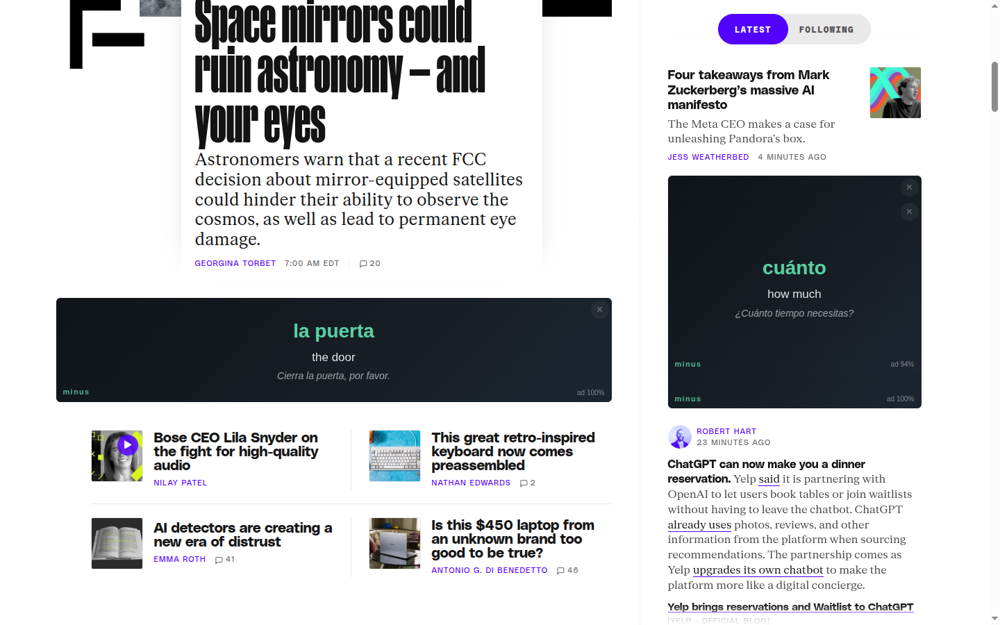
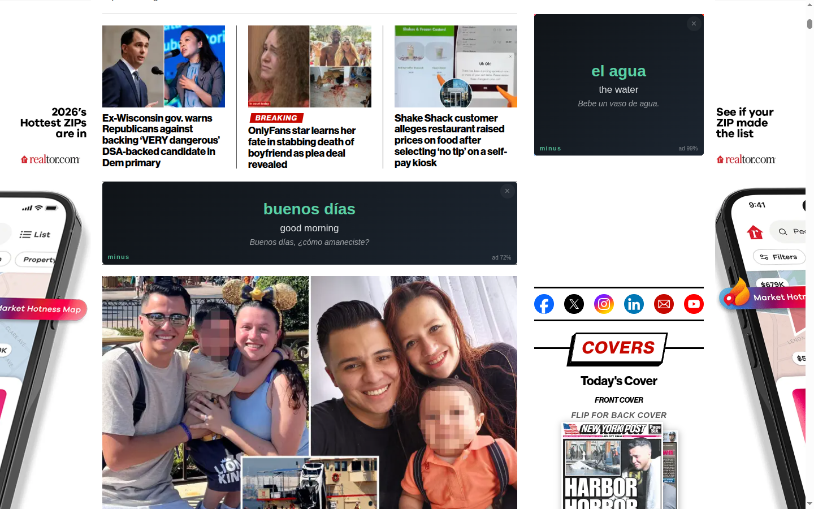
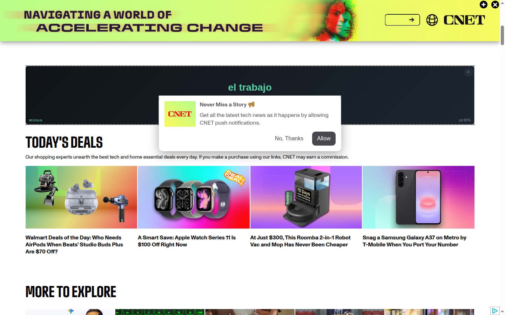
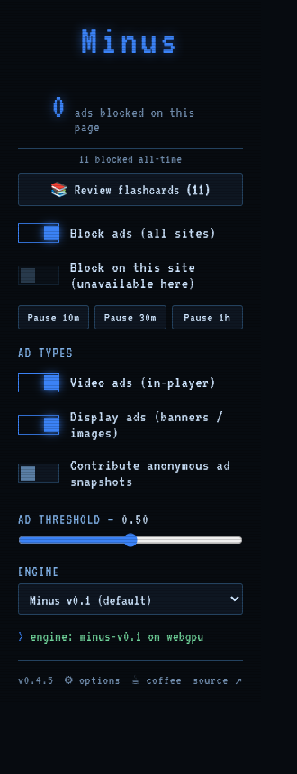
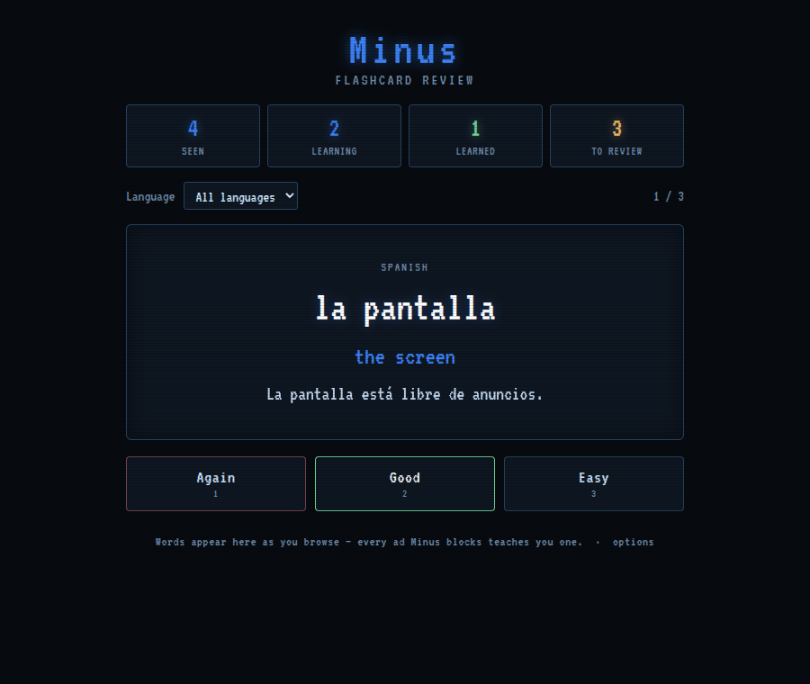
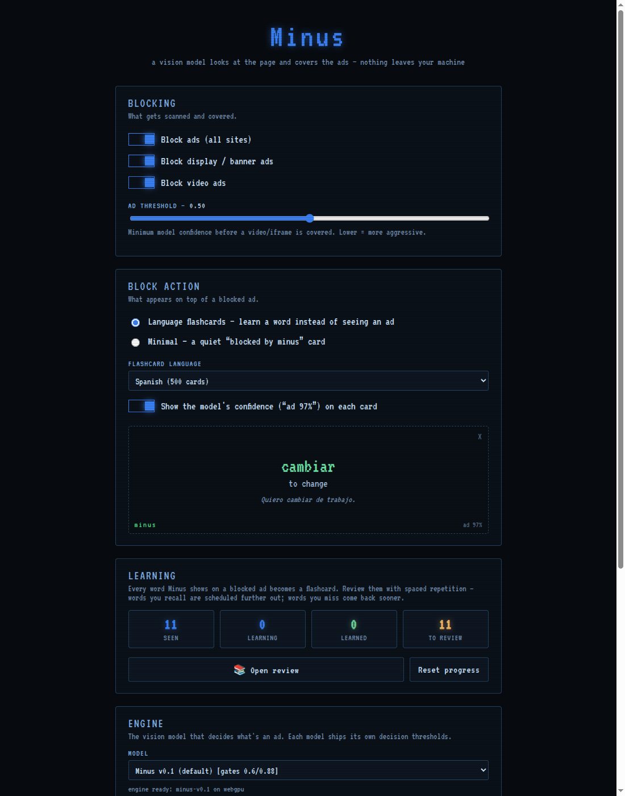

# Minus — vision ad blocker (Chrome extension)

[](https://huggingface.co/TheGarageDev/Minus-v0.1)
[](https://huggingface.co/spaces/TheGarageDev/Minus-v0.1-WebGPU)

The browser cousin of the [minus](https://github.com/garagehq/minus) HDMI
device: instead of matching filter lists, it **looks** at page elements with a
vision-language model running **entirely inside your browser** and covers the
ones that are ads with language flashcards — so every blocked ad teaches you a
word instead.

Nothing leaves your machine — no server, no filter-list subscriptions, no
telemetry. The model *sees* what you see.


*Real page, real ads: the banner and sidebar ad slots on theverge.com covered by
flashcards ("la puerta — the door", "cuánto — how much"), each with the model's
confidence tag and a faint ✕ to reveal the ad. The article is untouched.*

## How it works

A classic ad blocker matches **URLs** against filter lists. Minus classifies
**pixels** — so first-party ads, sponsored tiles, native "chum-box" placements
and streaming video ads that lists can't describe still get caught, and nothing
breaks when ad-tech rotates domains.

The pipeline, end to end:

1. **Find candidates.** The content script (running in every frame) collects
   elements that *could* be ads: ``s and `<iframe>`s, plus containers whose
   id/class smells like an ad slot. Obvious non-ads are filtered structurally —
   consent banners, video *players* (they belong to the video path), unloaded
   image placeholders, content-column-shaped boxes.
2. **Look at them.** For each candidate, Minus grabs actual pixels: a cropped
   tab screenshot for display elements (rate-limited, active tab only), or a
   direct frame read for `<video>`.
3. **Ask the model.** Crops go to a 450 M-parameter vision-language model —
   [**Minus-v0.1**](https://huggingface.co/TheGarageDev/Minus-v0.1) — running on
   your GPU via WebGPU (transformers.js + ONNX Runtime Web, quantized to
   ~430 MB). It answers one question per crop: *"Is this an advertisement?"* —
   and the Yes/No logits give a calibrated `p(ad)`.
4. **Decide with tiered thresholds.** An element *in ad context* (an ad iframe,
   a slot container) blocks at `p ≥ 0.60`; a bare image must clear `p ≥ 0.88`
   **and** be a standard ad shape (near-square product/editorial tiles are never
   blocked). Video verdicts need two consecutive ad frames (hysteresis), and a
   covered player keeps re-verifying so it **uncovers the moment the ad ends**.
5. **Cover, don't break.** Blocked elements get a flashcard overlay (word →
   translation → example sentence). The page layout is untouched; overlays track
   their element, step aside for modals, and carry a faint ✕ (reveal, with a
   transient **↩ re-block** undo) and an opt-in **⚑ not an ad** report button.
6. **Learn.** Every word shown on a blocked ad feeds the built-in
   [spaced-repetition review](#learn-as-you-block-spaced-repetition).

```
content.js (all frames)     background.js (SW)          offscreen.js (window)
───────────────────────     ─────────────────          ─────────────────────
top frame: static scan  →   captureVisibleTab      →   Minus-v0.1 (transformers.js,
  + iframe motion sampler    (rate-limited crops)       WebGPU) or SigLIP2 (ORT)
every frame: <video>    →   route classify + badge →   P(ad) per crop
  sampling (hysteresis)     + per-tab counter              │
      ↑                                                    │
  flashcard overlays  ←────────────────────────────────────┘
```

Only the **active tab** ever scans (a background tab capturing would read the
wrong pixels), scans coalesce and self-suspend when nothing is covered, and the
engine survives WebGPU device loss by rebuilding itself.

## In the wild

| | |
|---|---|
|  |  |
| *nypost.com — leaderboard + sidebar ads covered ("buenos días", "el agua")* | *cnet.com — display ad covered mid-article* |

| | |
|---|---|
|  |  |
| *The popup: counters, pause, ad-type toggles, threshold slider, engine picker* | *Review: words from blocked ads become a spaced-repetition deck* |


*Options: block action + flashcard language (with live preview), learning stats,
engine picker with per-model decision gates.*

## The model

The default engine is [**Minus-v0.1** on Hugging Face](https://huggingface.co/TheGarageDev/Minus-v0.1)
— a fine-tune of [LiquidAI/LFM2.5-VL-450M](https://huggingface.co/LiquidAI/LFM2.5-VL-450M)
trained over a 28-iteration campaign on streaming-TV captures from the minus
device plus web display ads and ~10 k mined hard negatives (product photography,
editorial content, UI elements, consent banners, chat widgets). Numbers at the
shipping gates:

| benchmark | result |
|---|---|
| Streaming holdout (1,956 frames) | **99.90 %** ad recall / **98.06 %** non-ad recall |
| Static-web bench (999 images) | **98.0 %** ad recall, 11 false positives |
| Product-image FP holdout | 1/199 |
| Live in-browser precision | ~90–94 % over month-long soaks |

The full model card — training recipe, ONNX quantization, usage from
transformers.js — is on the Hugging Face page.

## What it blocks

- **Display / banner ads** — static ``, ad `<iframe>`s, and ad-shaped
  slots, classified from a cropped tab screenshot.
- **Video ads** — the detector runs in **every frame** (`all_frames`), so it
  covers in-player `<video>` ads (re-sampled every ~2.5 s with 2-verdict
  hysteresis, like the minus device) *and* video ads inside cross-origin iframe
  players it can't see into (a top-frame motion sampler). Verified covering real
  ads on YouTube, USA Today, and Al Jazeera. A covered player **uncovers the
  moment the ad ends** (the model re-reads the live frame each tick). Genuinely
  DRM-protected players (some Vevo music videos) render as an unreadable black
  hardware overlay — their pre-rolls can't be *read*, so they aren't covered, but
  the guard makes sure their **content** is never mistakenly covered either.
- **Popup / popunder ad tabs** — aggressive sites (manga/stream readers) hijack
  clicks on non-link page areas to spawn tabs whose *entire page* is an ad
  landing. The **popup guard** notices the hijacked-click → new-tab pattern,
  asks the model about the page itself, and covers confident ad landings with an
  explicit choice: **Close tab** or **Show page** (never auto-closes; tabs
  opened from real links are never touched).
- Overlays **yield to page UI** — if a modal/lightbox opens over a covered ad,
  the flashcard steps aside (clip-path hole) so the dialog stays clickable.

## The popup (left-click the icon)

The quick panel:

- **Ads blocked on this page** counter (mirrors the toolbar badge; the M icon is
  blue at rest, red while blocking) plus an **all-time blocked** tally.
- **Block ads (all sites)** — master on/off. Turning it off fully unloads the
  model from the engine (frees GPU memory).
- **Block on this site** — per-hostname toggle.
- **Pause 10m / 30m / 1h** — snooze blocking, then it **auto-resumes** on a timer
  (a countdown + *Resume now* replace the buttons while paused).
- **Ad types** — independent **Video ads** and **Display ads** toggles (applied
  live, no reload).
- **📚 Review flashcards** — opens the review page; the button shows how many
  cards are due so the words you meet on ads don't just flash by (see below).
- **Ad threshold slider** (live value, can't hold junk), **Engine** picker with
  switch feedback, live engine status. A warning appears if you switch both ad
  types off while the master toggle is still on.
- **Contribute anonymous ad snapshots** — opt-in, off by default (see Privacy).
  When it's on, each overlay gets a **⚑ not an ad** button (revealed on hover /
  focus) to report a false positive so the snapshot is flagged for review.
- **⚙ options** — opens the full options page.

## Learn as you block (spaced repetition)

The flashcards aren't just decoration. **Every word Minus shows on a blocked ad
is quietly saved**, and the **Review** page turns them into a real
spaced-repetition deck (like Anki, built in):

- Grade each card **Again / Good / Easy** (keyboard: `space` to flip, `1/2/3` to
  grade). An SM-2-style scheduler spaces words you know further out and brings
  back the ones you miss; new cards are introduced a handful at a time per day.
- A progress strip tracks **seen · learning · learned · to review**, filterable
  by language, so the ads you *would* have watched become vocabulary you keep.
- Nothing leaves your machine — progress lives in local storage; the **Learning**
  section of the options page shows your stats and can reset progress.

## The options page (⚙ in the popup, or right-click the icon → Options)

A full-page superset of the popup, plus settings that only live here:

- **Block action** — what appears over a blocked ad:
  - **Language flashcards** (default) in **Spanish, French, German, Italian,
    Portuguese, Japanese, or Greek** — a **500-word deck per language**
    (`decks/*.json`), every blocked ad becomes a vocabulary card (word →
    translation → example sentence), with a live preview.
  - **Minimal** — a quiet dark card that just says the ad was blocked.
  - Toggle the **model-confidence tag** ("ad 97%") shown on each card.
  - Changes apply to overlays already on screen — no reload.
- **Disabled-sites list** — edit the per-site blocking list as text (the
  popup's per-site toggle writes the same list).
- **Ad threshold slider** (same setting as the popup) and the **Engine picker**
  with each model's decision gates, live engine status.

## Engines

The engine list is generated from the packaged models (`models/index.json`), so
dropping in a new model dir makes it selectable with no code changes. Switch in
the popup (reloads the engine).

**Per-engine decision thresholds** (since v0.3.1): a catalog entry can carry
`"thresholds": { "ctx": …, "bare": … }` — the confidence bars content.js applies
to ad-context elements (iframes / ad-slots) and bare standard-size images.
Each model ships its own operating point instead of inheriting a predecessor's;
the current default (Minus v0.1) runs 0.60 / 0.88. When a model's score
distribution separates ads cleanly, looser gates buy recall for free — the
Iter 24 era shipped 0.35 / 0.75 and a 60-minute live A/B measured **~33 % more
ads covered at unchanged ~90 % precision**.

| Engine (`key`) | Model | Notes |
|---|---|---|
| **`lfm`** (default) | [**Minus v0.1**](https://huggingface.co/TheGarageDev/Minus-v0.1) (LFM2.5-VL-450M fine-tune), q4/q8 ONNX (~431 MB) | The open-source shipping model — streaming holdout 99.90/98.06 (best-ever), static-web bench 98.0 % ad recall @ 11 FPs with PR-curve dominance. **WebGPU only.** |
| `lfm-iter27b` | LFM Iter 27b-web | Previous default (v0.3.8, chat-widget/site-header hard negatives + scale-jitter). WebGPU only. |
| `lfm-iter26` | LFM Iter 26-web | Previous default (v0.3.7, self-promo/UI negatives). WebGPU only. |
| `lfm-iter27` | LFM Iter 27-web | Candidate superseded by 27b (fixed Botsonic, regressed 9GAG signup). WebGPU only. |
| `lfm-iter25` | LFM Iter 25-web | Previous default (v0.3.2, mined hard-positive retrain). WebGPU only. |
| `lfm-iter24` | LFM Iter 24-web | Previous default (v0.3.0, content hard-negatives, tuned 0.35/0.75 gates). WebGPU only. |
| `lfm-iter21` | LFM Iter 21-web | Previous default. WebGPU only. |
| `lfm-iter22` | LFM Iter 22-web | Experimental; higher web-ad recall (more content FPs). WebGPU only. |
| `lfm-iter23` | LFM Iter 23-web | Content hard-negatives on the Iter 22 base (superseded by Iter 24). WebGPU only. |
| `lfm-web` | LFM Iter 20-web | Aggressive web-ad blocking (more FPs on product imagery). WebGPU only. |
| `lfm-stream` | LFM Iter 14 | Streaming-tuned (99.08 % frozen holdout). WebGPU only. |
| `siglip2` | SigLIP2-SO400M-384 fine-tune | Single forward pass, fast; large (~817 MB fp16). |

### Requires WebGPU

The default LFM engines are **WebGPU-only** — their quantized graph uses the
`GatherBlockQuantized` op, which ONNX-Runtime's WASM backend can't run. WebGPU is
on by default in Chrome/Edge 121+; if it's unavailable the popup status shows a
clear "needs WebGPU — enable it and reload" message. The WebGPU load and warm-up
are timeout-bounded, so a flaky GPU driver can't wedge the engine.

> A retrained SigLIP2-Lite **WASM fallback** was prototyped so no-WebGPU
> machines could still run a classifier, but shelved — WASM inference for this
> ViT is ~7 s/image, too slow for a real experience (int8 quant, which would
> shrink it, collapses this model's ad recall). The work lives on the
> [`siglip2-wasm-fallback`](https://github.com/garagehq/Minus-chrome-extension/tree/siglip2-wasm-fallback)
> branch.

## Install (unpacked)

The extension isn't on the Chrome Web Store yet, so you load it unpacked from
the release zip. It's a two-minute, four-step process:

1. **Download** the latest `minus-extension-vX.Y.Z.zip` (~400 MB — it bundles
   the vision model) from
   [Releases](https://github.com/garagehq/Minus-chrome-extension/releases).
2. **Unzip it.** You get a folder like `minus-extension-vX.Y.Z/` with
   `manifest.json` right inside it — that folder *is* the extension (no nested
   `extension/` subfolder to dig into).
3. Open `chrome://extensions`, turn on **Developer mode** (top-right toggle),
   click **Load unpacked**, and select the **unzipped folder** from step 2 (the
   one containing `manifest.json`).
4. Browse an ad-heavy site. The model loads on first use (~20–60 s), then
   overlays appear on detected ads. Left-click the toolbar icon for all
   settings.

To update later: download the newer zip, unzip it, and either **Load unpacked**
the new folder or hit the ↻ reload on the existing card after replacing the
files. Works the same in **Edge** (`edge://extensions`) and other Chromium
browsers.

Requirements: Chrome/Chromium/Edge 121+ (WebGPU recommended); ~1–2 GB free RAM.

**Platforms.** WebGPU has shipped in Chrome since 113 on **macOS** (backed by
Metal — both Apple Silicon and Intel Macs), Windows (D3D12), and ChromeOS, and
on Linux more recently. So the default LFM engine runs on the GPU on essentially
all current desktop Chrome/Edge installs. Apple Silicon Macs are an especially
good fit (unified memory + a strong Metal GPU).

## Privacy & opt-in data contribution

See [PRIVACY.md](PRIVACY.md). Default: nothing leaves your machine.
Toggle **Contribute anonymous ad snapshots** in the popup to opt in (element
crop + hostname only, 10-min local cool-down; clicking ✕ on an overlay retracts
the sample before upload).

## Dev

```bash
npm install
node build.mjs            # bundles ORT + transformers.js into extension/dist/,
                          # and regenerates models/index.json from the model dirs
node build_model_index.mjs  # (index only)
# load extension/ as an unpacked extension (chrome://extensions, Developer mode)
```

## Tests

```bash
npm test                 # fast regression: model catalog + auto-discovery,
                         # overlay occlusion, popup branding/charset, badge
                         # counter, ad-type toggles (no GPU / no model download)
```

Heavier, GPU-backed suites (real model + real sites) live under `tests/` and use
`tests/harness.mjs` (`launchWithExtension`, `waitForEngine`, `serveFixtures`).
Headless WebGPU on Linux/NVIDIA needs
`--enable-unsafe-webgpu --ignore-gpu-blocklist --use-angle=vulkan
--enable-features=Vulkan --disable-vulkan-surface` and the full Chromium build
(Playwright `channel: "chromium"`), not the headless shell. Real-world **headed**
soaks (WebGPU is happier with a real display — use `Xvfb :99`) include
`tests/e2e_headed_multitab.mjs <N>` (multi-tab active-only + video block/unblock
+ disable-teardown across N live sites) and `tests/e2e_youtube.mjs <N>` (real
YouTube pre-rolls: every covered player must uncover once the ad ends).

## Support

Minus is free, open-source, and runs entirely on your machine — no ads, no
tracking, no server bills passed on to you. If it saves you from a few
autoplay pre-rolls, you can buy me a coffee ☕:

<a href="https://buymeacoffee.com/cyrilengmann" target="_blank"></a>

> **[buymeacoffee.com/cyrilengmann](https://buymeacoffee.com/cyrilengmann)**

There's also a **☕ coffee** link in the extension popup footer.

## License

MIT
